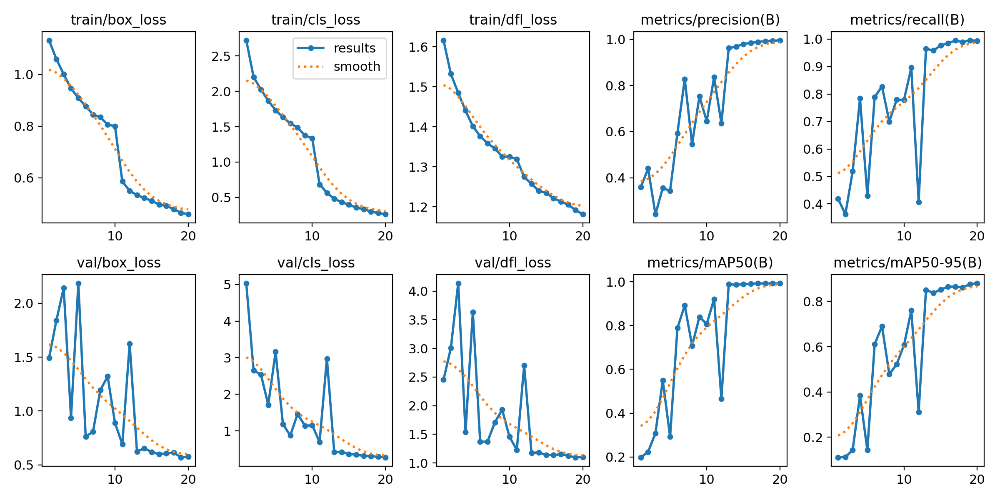
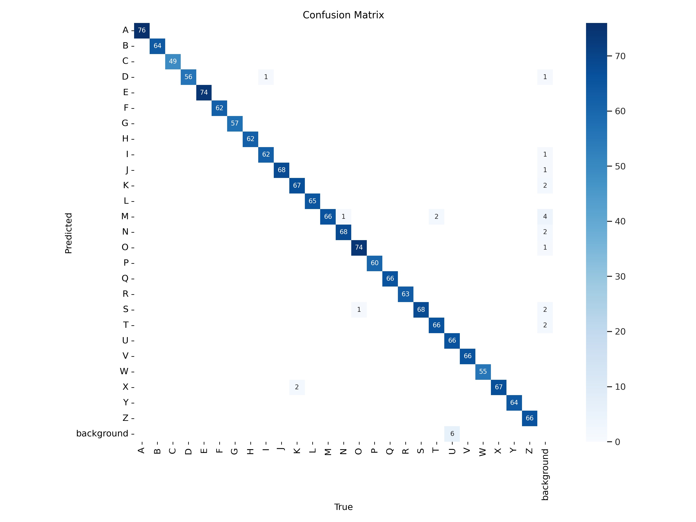

# 🤟 SIBI Alphabet Detection — YOLOv8

Deteksi huruf alfabet **Bahasa Isyarat Indonesia (SIBI)** secara real-time menggunakan **YOLOv8**. Model mengenali **26 huruf (A-Z)** dari gesture tangan.



## 📊 Performa Model

| Metrik | Nilai |
|---|---|
| **Precision** | 99.66% |
| **Recall** | 99.32% |
| **mAP50** | 99.26% |
| **mAP50-95** | 88.00% |

> Trained with YOLOv8n, 20 epochs, Adam optimizer, 640×640 image size.

<details>
<summary>📉 Confusion Matrix</summary>



Huruf dengan akurasi lebih rendah: C (49), W (55), G (57), P (60).

</details>

## 📁 Struktur File

```
├── Model/
│   ├── best.pt                  # Model terbaik (PyTorch)
│   ├── best.onnx                # Model terbaik (ONNX / deployment)
│   └── last.pt                  # Model iterasi terakhir
├── Result/
│   ├── results.csv              # Training metrics per epoch
│   ├── results.png              # Training curves
│   └── confusion_matrix.png
├── 1. train.py                  # Script training model
├── 1. YOLOv8-Training.ipynb     # Notebook training (Google Colab)
├── 2. predict.py                # Script prediksi (image/folder/webcam)
├── 2. YOLOv8-Predict.ipynb      # Notebook prediksi
├── requirements.txt             # Dependencies
├── .env.example                 # Template environment variable
└── README.md
```

## 🚀 Setup

```bash
# Clone repository
git clone https://github.com/iDoust/Indonesian-Sign-Language-SIBI-Detection-Using-YOLOv8.git
cd Indonesian-Sign-Language-SIBI-Detection-Using-YOLOv8

# Install dependencies
pip install -r requirements.txt

# Setup environment variable (untuk training)
cp .env.example .env
# Edit .env dan masukkan API key Roboflow
```

## 🔍 Prediksi

```bash
# Prediksi dari gambar
python "2. predict.py" --source path/to/image.jpg

# Prediksi dari folder gambar
python "2. predict.py" --source path/to/folder/

# Real-time webcam
python "2. predict.py" --webcam

# Simpan hasil ke folder output/
python "2. predict.py" --source image.jpg --save

# Custom confidence threshold
python "2. predict.py" --source image.jpg --conf 0.7

# Gunakan model PyTorch (default: ONNX)
python "2. predict.py" --source image.jpg --model Model/best.pt
```

## 🏋️ Training

```bash
# Training default (20 epochs, YOLOv8n)
python "1. train.py"

# Custom training
python "1. train.py" --epochs 100 --model yolov8s.pt --imgsz 640

# Lihat semua opsi
python "1. train.py" --help
```

## 🛠 Teknologi

- **Python** 3.x
- **YOLOv8** (Ultralytics) — Object Detection
- **PyTorch** — Deep Learning Framework
- **OpenCV** — Computer Vision
- **ONNX** — Cross-platform Model Format
- **Roboflow** — Dataset Management

## 📊 Arsitektur Model

```
Input (640×640) → CSPDarknet (Backbone) → PANet/FPN (Neck) → Detection Head
                                                                ├── Bounding Box
                                                                ├── Confidence Score
                                                                └── Class (A-Z)
```

## 📚 Dataset

Dataset gesture tangan bersumber dari Roboflow:
🔗 [USIBI Dataset — Roboflow](https://universe.roboflow.com/usibi-image-translate/usibi-jueew)

- **26 kelas**: Huruf alfabet A-Z
- **Format**: YOLOv8 (bounding box annotations)
- **Augmentasi**: Default Ultralytics (mosaic, flipping, scaling)

## 📝 Lisensi

MIT License
